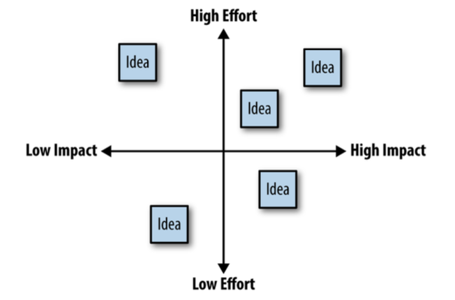

# Product Management notes from different sources

## About what is a good Product Manager
* Product Manager means doing different things
* Find ways to align motivate and inspire the team
* Be proactive about seeking out ways to help and contribute
* Be a **connector** between teams and roles

### Core skills of product management
* Communication (between stakeholders and users)
* Organisation (Of the product team for success in collaboration)
* Research (New ideas and perspectives)
* Execution (Of day to day tasks)

## About attitude
Be curious. Taking real interest in the work that people do have the effect of getting trust from people. "I'm curious about the work you do" is a powerful way to achieve this.

Two types of mindset:
* Fixed: Failures are seen as setbacks and negative work feedback
* Growth: Failures and setbacks are seen as opportunities

## About communication
* Prefer overcommunication
* Don't be afraid to ask the obvious
* Avoid the temptation of being a meeting hater. Make sure that everybody's time is well spent
* Use "Disagree and commit" to express opinion in meetings.
* Avoid sentences with "It would be great if..." or "Do you think it might be possible to...". Ask direct questions.

## About working with stakeholders
"Managing up" is an expression used when working with senior stakeholders
* A Product Manager can't succeed if there is no clarity among senior leaders about the company's strategy and vision.
*  When a directive comes down from senior leaders you manage up for clarity. You explain those senior leaders why it doesn't make sense what trade-offs are at play and what the downstream implications of their demands might be.
  
 "When working with senior stakeholders" checklist:
 * Don't set out to win. Empower them to make great decisions. 
 * Push upward for clarity around company strategy and vision.
 * Don't try to protect the team from sr. stakeholders by talking about how ignorant, arrogant they are. Instead, bring concerns directly to sr. stakeholders and walk them through making the trade-offs that will best serve your company goals.
 * Never surprise senior stakeholders with a big idea in an important meeting.
 * Don't let company politics drown out the needs of the users.
 * Align business goals and users needs.
 * Let stakeholders participate in making tactical trade-offs.
 * Find out why something suddenly changes. There might have been an important high-level conversation that you are not aware of.

## About talking to users
* Always ask about specific instances not generalisations. Instead of: "What do you usually eat for lunch?" ask "Walk me through the last meal you ate".
* Don't get too excited if you hear what you thought you wanted to hear.
* Don't ask users to do your job for you.
* Ask questions like (These are called leveling up questions):
   * What was your shopping experience like? 
   * Walk me through the whole shopping trip.
* "Live in your users reality".
* Remember that talking to users and working with stakeholders are different things and require different approaches.

## About Data Driven Product Management
* To open up a conversation about assumptions, build a formal template for every data driven decision that provides an opportunity to document goals, assumptions and questions. Such template can be something like:
  * The decision I'm trying to make or the problem I'm trying to solve is:
  * The data I'm using to make this decision is:
  * Why I believe that this data will help me make this decision.
  * What I believe this data is telling me.
  * What assumptions are present in my interpretation of this data?
  * How we might test those assumptions.
  * The next step intending to take is:
* Product managers can be held accountable for the following things:
   * Knowing which metrics matter and why
   * Having clear targets for these metrics?
   * Knowing what's going on with the metrics right now.
   * Identify the underlying issues that are causing this metrics to know what they are doing.
   * Having a plan to address the underlying issues affecting these metrics.

## About LEAN Metrics
### Customer development
It is focused on collecting continuous feedback that will have a material impact on the direction of a product and business, every step of the way.
One of the main Lean Startup's core concepts is build -> measure -> learn, teh process by which you do everything, from establishing a vision to build product features to developing channels and marketing strategies.

## About Roadmaps and prioritisation
* As a rule, the product roadmap should be something that encourages collaboration and focuses that collaboration are on high-level goals
* The challenge for a Product Manager is not so much to have ideas but rather to establish criteria that can be used to consistently evaluate ideas against user needs and business goals
* A Product Manager should consider providing templates that structure new ideas to people. This is called Product Requirement Document (PRD). Here's an example that can be used for such template:
  * **Product idea:**
  * Which of our users (current or perspective) this is for:
  * How this idea will improve your experience:
  * How this idea will help our business:
  * How we will measure success:
* As a Product Manager, your job is to open the roadmap to a shared company wide discussion about what you are building, who you are building it for and why.
*  Leveling up the conversation from technical details to higher level goals will give everybody more room to find the best possible solution when the product or feature is actually being built.
* Prioritisation is where organisational goals and vision turn into actual decisions about timing and resource allocation.
*  The use of a Impact-Versus-Effort Matrix helps with the prioritisation process. See: 
There are different ways to bring rigor and structure to the organisational goals:
*  SMART goals (Specific, Measurable, Achievable, Relevant, Time-bounded)
*  CLEAR goals (Collaborative, Limited, Emotional, Appreciable, Refinable)
*  OKRs (Objective and Key Results)
The way to review goals to prioritise is simple. Go trhough a backlog of potential product and potential feature ideas to see whether the goals would clearly indicate on what to work next. If there is one that would increase revenue and other that would potentially bring new users, which is more important? If there is a long-standing user complaint about an existing feature, how can its value be quantified compared to a new feature?